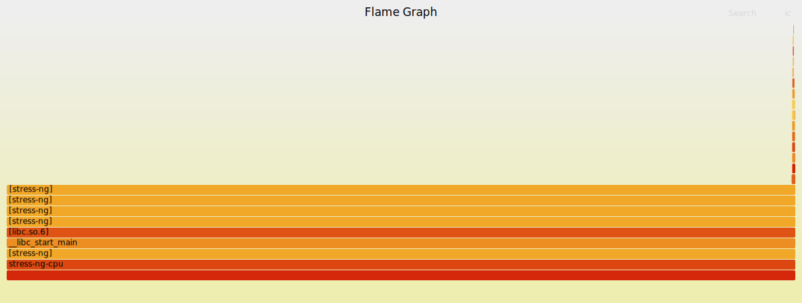
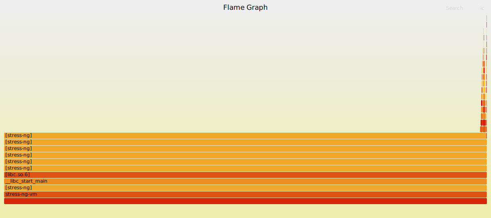

# 火焰图热点分析报告

## 1. 生成结果

matrixprod 火焰图：

rand-set 火焰图：

## 2. matrixprod 负载分析

`matrixprod` 是矩阵乘法类计算负载，CPU 时间主要集中在 stress-ng 的矩阵计算路径中。火焰图整体更接近热点集中的形态，说明程序大部分时间在重复执行稳定的计算循环。

该负载的分支预测失败率较低，说明分支不是主要瓶颈。结合 perf stat 中 IPC 约为 1.00、L1 DCache Miss Rate 较高的现象，可以判断其压力主要来自计算循环中的数据访问和执行单元利用。

## 3. rand-set 负载分析

`rand-set` 是随机访存型负载，访问地址更分散，空间局部性弱。火焰图相比 matrixprod 更容易出现分散的栈形态，说明 CPU 时间不仅消耗在用户态访问循环中，也可能受缺页、页表访问和内存管理路径影响。

结合 perf stat 结果，rand-set 的 L1 DCache Miss Rate 达到 48.84%，明显高于 read64，说明随机访问破坏了缓存局部性，硬件预取器难以提前加载后续数据。

## 4. 对比结论

计算密集型负载的热点更集中，访存随机性强的负载热点更分散。若火焰图中出现 `__do_page_fault`、`copy_page` 等内核态函数，通常说明访问过程中触发了缺页、页表处理或内存页初始化，这些路径会增加访存延迟并降低整体吞吐。

本实验运行在 WSL2 虚拟化环境中，内核态栈和部分硬件事件可能受虚拟化层影响，因此分析时同时参考 perf stat 和火焰图趋势。
