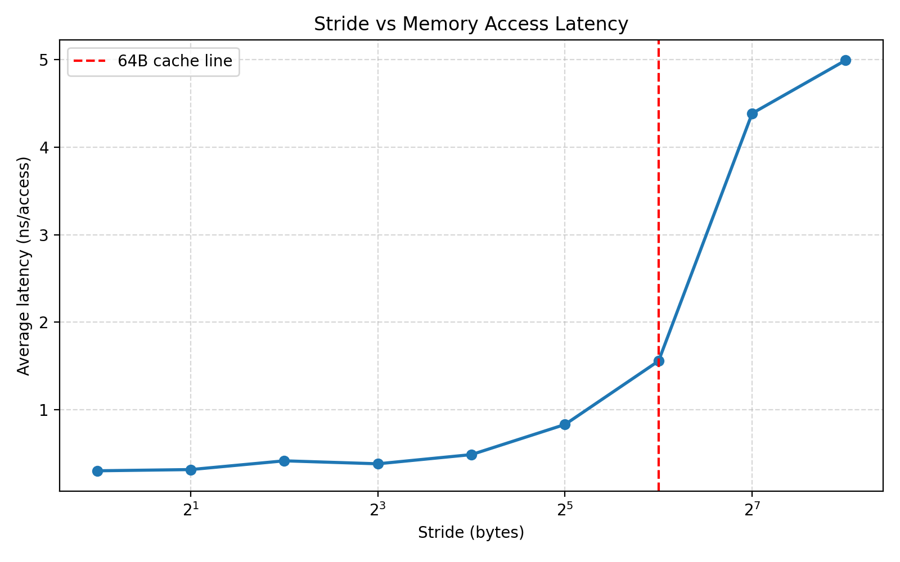
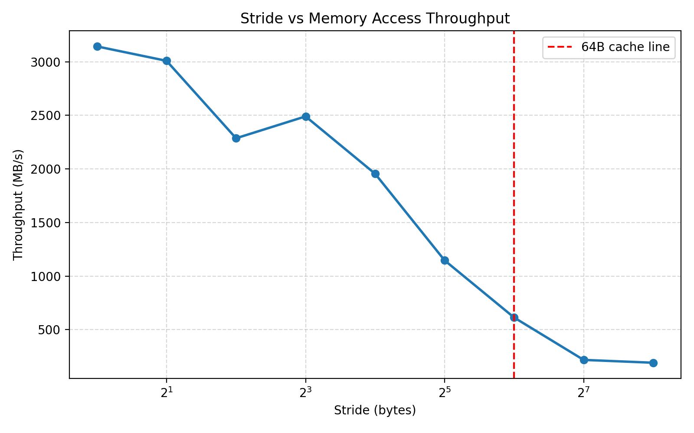

# Cache Line 微基准测试报告

## 1. 程序设计

本实验编写 C 程序 `src/cache_line_test.c`，申请 256MB 数组，并以不同步长遍历数组。测试步长为 1、2、4、8、16、32、64、128、256 字节。程序记录每种步长下的总访问次数、运行时间、平均访问延迟和吞吐量。

数组使用 64B 对齐分配，减少非对齐访问对结果的影响。循环中使用 `volatile` 累加变量，避免编译器将访存循环优化掉。

## 2. 性能数据

| stride(bytes) | accesses | time(s) | ns/access | throughput(MB/s) |
|---:|---:|---:|---:|---:|
| 1 | 2147483648 | 0.651570 | 0.303 | 3143.18 |
| 2 | 1073741824 | 0.340348 | 0.317 | 3008.69 |
| 4 | 536870912 | 0.223969 | 0.417 | 2286.03 |
| 8 | 268435456 | 0.102810 | 0.383 | 2490.04 |
| 16 | 134217728 | 0.065472 | 0.488 | 1955.02 |
| 32 | 67108864 | 0.055839 | 0.832 | 1146.15 |
| 64 | 33554432 | 0.052232 | 1.557 | 612.66 |
| 128 | 16777216 | 0.073566 | 4.385 | 217.49 |
| 256 | 8388608 | 0.041878 | 4.992 | 191.03 |

原始数据保存在 `results/performance.csv`。

## 3. 曲线图

延迟曲线：

吞吐量曲线：

## 4. Cache Line 拐点分析

实验结果显示，在 stride=1B 到 32B 之间，平均访问延迟从 0.303 ns/access 上升到 0.832 ns/access，增长较缓；当 stride 达到 64B 时，延迟上升到 1.557 ns/access；当 stride 增加到 128B 和 256B 时，延迟进一步升高到 4.385 和 4.992 ns/access。

吞吐量也呈现对应下降趋势：stride=1B 时约 3143 MB/s，stride=64B 时下降到约 613 MB/s，stride=128B 后下降到约 200 MB/s。该趋势说明，当访问步长接近或超过典型 x86 CPU 的 64B cache line 大小时，每次访问更可能触发新的 cache line 加载，空间局部性下降，访存层级开销显著增加。

由于实验运行在 WSL2 虚拟化环境中，个别点存在小幅波动，但整体趋势清晰，不影响 64B cache line 拐点结论。

## 5. perf stat 与火焰图

各 stride 的 perf stat 原始输出保存在 `results/stride_*_perf.txt`。

火焰图文件：

- `flamegraphs/stride1.svg`
- `flamegraphs/stride64.svg`

`stride=1` 时，连续访问具有较好的空间局部性，一次 cache line 加载可以服务多个后续访问。`stride=64` 时，每次访问更容易落到新的 cache line，cache line 利用率下降，因此平均访问延迟上升、吞吐量下降。

## 6. AI 辅助说明

本实验使用 AI 工具辅助完成需求拆解、WSL2 perf 问题排查、C 程序编写、编译 warning 修复、性能曲线生成和报告分析。相关记录保存在 `ai-chat-log/`。
